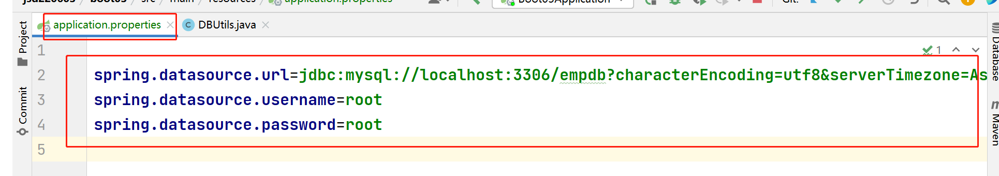

### 商品管理系统步骤:

1. 创建boot02-1工程   
2. 在static里面创建index.html首页页面, 在页面中添加超链接, 请求地址为/insert.html
3. **添加功能:**创建insert.html页面, 页面中有form表单获取用户输入的商品信息,提交地址为/insert
4. 创建controller.ProductController,添加@RestController注解, 添加insert方法处理/insert请求,创建entity.Product实体类,  在insert方法参数列表处声明Product对象 接收传递过来的参数, 控制台输出接收到的product对象, 如果没有问题接下来通过JDBC代码把product对象中的数据保存到product表中 给客户端响应"添加完成! 返回首页"
5. **列表功能:**在首页中添加商品列表超链接, 请求地址为/select ,在Controller中添加select方法处理/select请求,在方法中通过JDBC代码查询到所有商品的信息并把商品信息封装到Product对象中,然后把Product对象装进一个List集合,  最后遍历集合把数据装进一个html字符串中 响应给客户端(可复制粘贴)
6. **删除功能:** 在商品列表的表格中添加操作列, 每一行数据添加一个删除超链接, 请求地址为/delete?id=xxx
7. 在ProductController中添加delete方法处理/delete请求, 接收传递过来的id参数并在控制台输出测试, 如果没有问题 则通过JDBC代码 执行删除的SQL语句 把数据库中的数据删除掉,然后给客户端响应"删除完成 返回首页"
8. **修改功能**:在首页添加修改超链接, 请求地址为/update.html页面
9. 创建update.html页面,页面中提供form表单获取输入的修改信息, 提交地址为/update
10. 在ProductController中添加udpate方法 处理/update请求, 方法的参数列表处声明Product对象接收传递过来的参数,控制台输出 测试, 如果测试没问题 通过JDBC代码执行SQL语句把数据库里面的数据修改掉.最后给客户端响应"修改完成 返回首页"

### MyBatis框架

- 此框架是目前最流行的数据持久层框架, 框架可以帮助我们生成JDBC代码, 从而提高开发效率 .使用此框架程序员只需要通过注解或xml配置文件写好需要执行的SQL语句, Mybatis框架会自动生成对应的JDBC代码  

- 如何使用Mybatis框架

  - 创建boot03工程, 打钩3个

    - Web->Spring Web
    - SQL-> Mybatis Framework
    - SQL-> MySQL Driver 

  - 创建完工程后需要在application.properties 配置文件中添加连接数据库的信息
  
    

​			