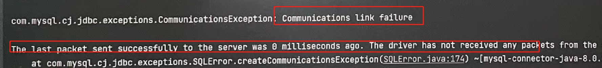
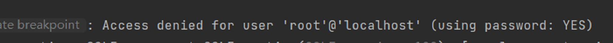
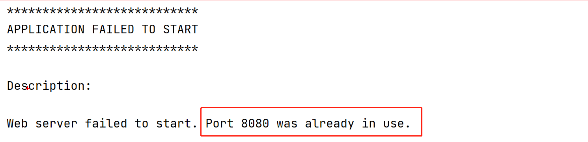
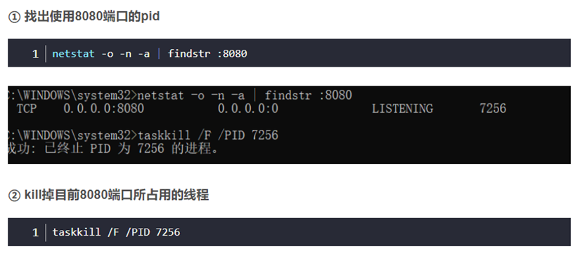
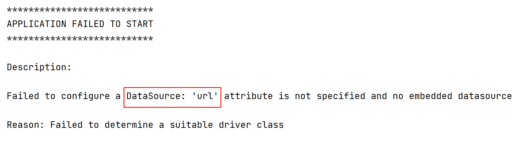
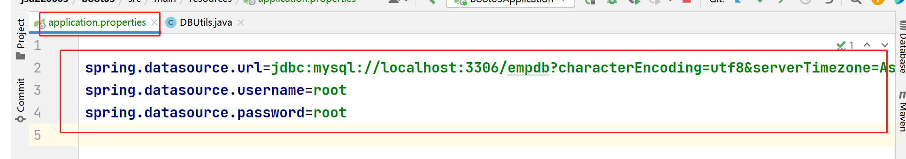

1. 500状态码: 代表服务器业务代码出错,也就是执行Controller里面的某个方法的过程中报错, 此时在idea的控制台中会显示具体的错误信息, 所以需要去看idea控制台的报错 

2. 404状态码: 找不到资源            localhost:8080/reg.html

   1. 找不到静态资源

      - 检查请求地址是否拼写错误           
      - 检查静态资源文件的位置是否正确
      - 如果以上都没有问题需要Build->ReBuild Project  然后重启工程测试    

   2. 找不到动态资源

      - 检查请求地址是否拼写错误

      - 检查Controller中是否添加了@Controller注解或@RestController注解 

      - 检查@RequestMapping("路径") 注解里面的路径是否和请求路径一致

      - 检查controller包是否创建在了工程自带的包里面

      - 如果以上都没有问题需要Build->ReBuild Project  然后重启工程测试

3. 运行的是新工程但是显示的却是之前工程的页面, 这种情况是因为浏览器加载的是缓存内容.在浏览器访问的老的页面中Shift+F5  清缓存刷新

4.  MySQL服务重启电脑时自动关闭了,会导致以下报错, 需要找到MySQL服务开启

      

5. 连接数据库时用户名或密码错误

   

6. 8080端口被占用:

   

		- 检查是不是其它工程正在运行, 关闭其它工程即可解决
  - 如果其它工程没有运行,可能是idea异常关闭导致8080端口被占用
    - 重启电脑
    - 找到占用8080端口的进程杀掉()



   - 修改工程的端口号, 在application.properties里面添加以下内容修改工程的端口号

     ```
     server.port=8081
     ```

7. Mybatis工程没有配置连接数据库的信息导致工程启动报错:

   

		- 解决方案: 在application.properties里面配置连接数据库的信息

​		

```
spring.datasource.url=jdbc:mysql://localhost:3306/empdb?characterEncoding=utf8&serverTimezone=Asia/Shanghai&useSSL=false
spring.datasource.username=root
spring.datasource.password=root
```
