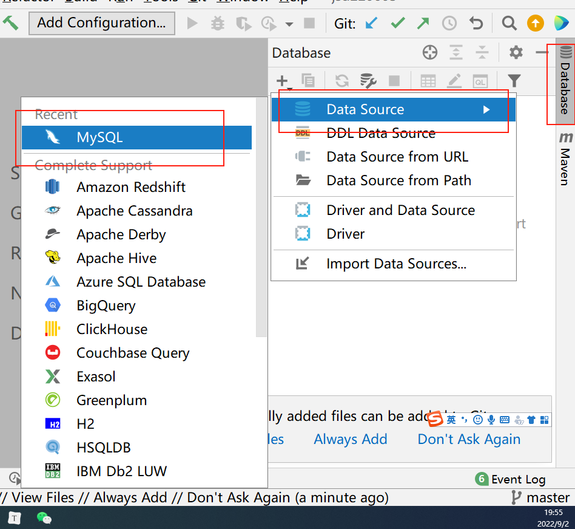
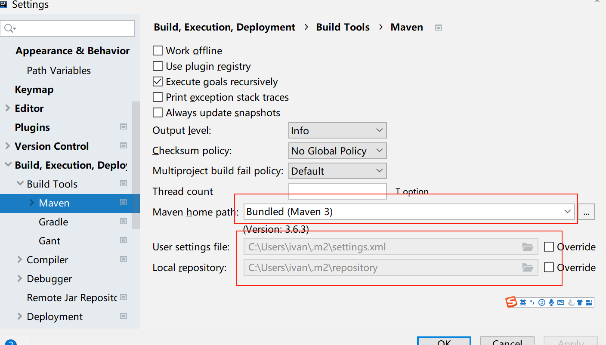
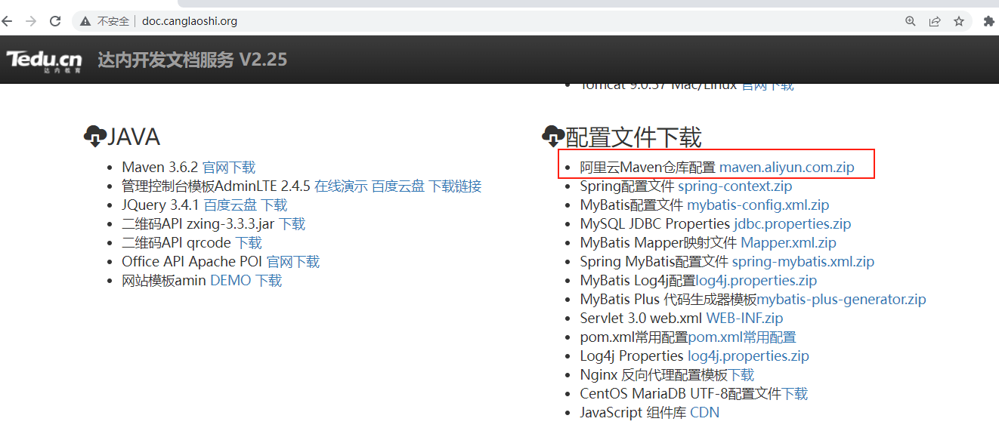
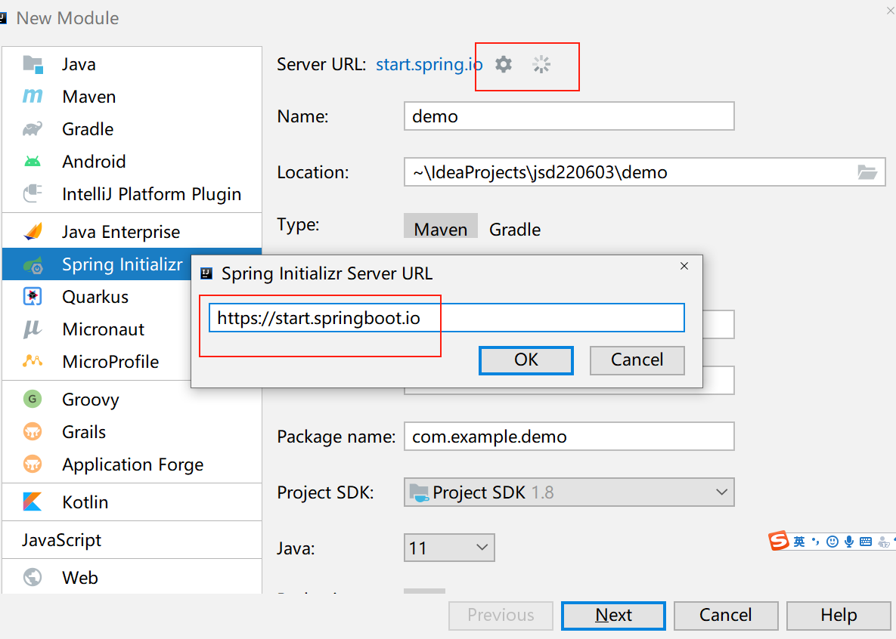
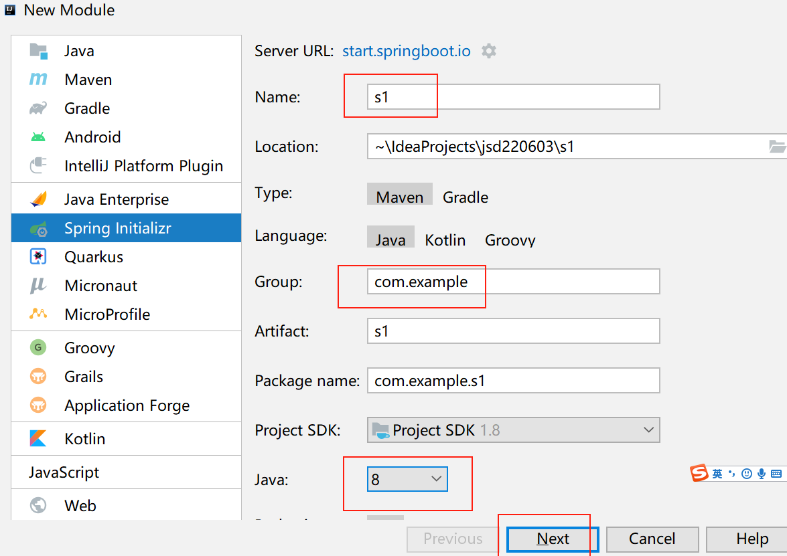
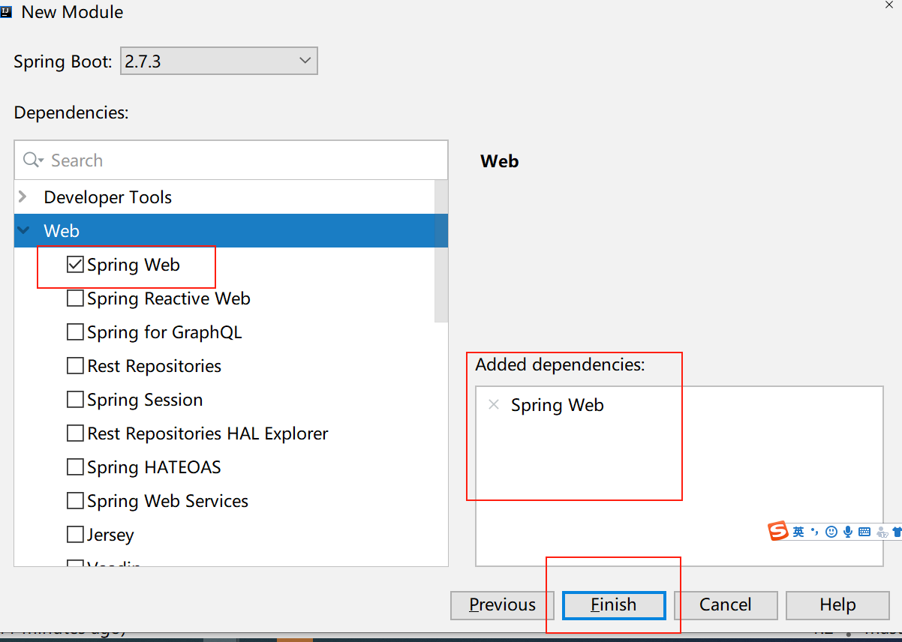
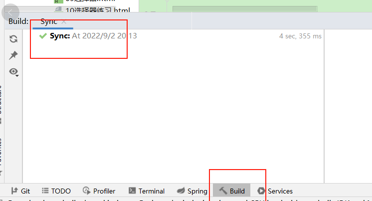
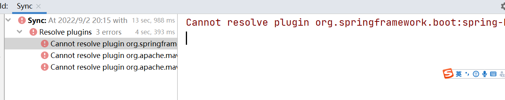
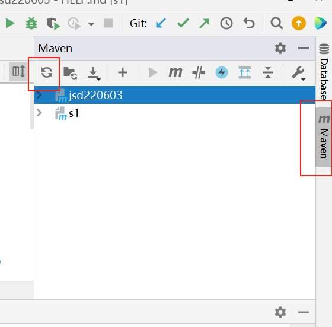

# 06数据库day02

### 综合练习

○ 创建数据库newdb1, 字符集utf8并使用
create database newdb1 charset=utf8;
use newdb1;
○ 在数据库中创建员工表emp 字段:id,name,sal(工资),deptId(部门id) 字符集utf8
create table emp(id int,name varchar(50),sal int,deptId int);
○ 创建部门表dept 字段:id,name,loc(部门地址) 字符集utf8
create table dept(id int,name varchar(20),loc varchar(20));
○ 部门表插入以下数据: 1 神仙部 天庭       2 妖怪部  盘丝洞
insert into dept values(1,'神仙部','天庭'),(2,'妖怪部','盘丝洞');
○ 员工表插入一下数据:  1 悟空 5000 1  ,   2 八戒  2000  1  ,3 蜘蛛精 8000  2  ,  4 白骨精 9000  2
insert into emp values(1,'悟空',5000,1),(2,'八戒',2000,1),(3,'蜘蛛精',8000,2),(4,'白骨精',9000,2);
○ 查询工资6000以下的员工姓名和工资
select name,sal from emp where sal<6000;
○ 修改神仙部的名字为取经部
update dept set name='取经部' where name='神仙部';
○ 给员工表添加奖金comm字段
alter table emp add comm int;
○ 修改员工表中部门id为1的 奖金为500
update emp set comm=500 where deptId=1;
○ 把取经部的地址改成五台山
update dept set loc='五台山' where name='取经部';
○ 修改奖金字段为性别gender字段 类型为varchar(5)
alter table emp change comm gender varchar(5);
○ 修改孙悟空和猪八戒性别为男
update emp set gender='男' where deptId=1;
○ 删除没有性别的员工
delete from emp where gender is null;
○ 删除性别字段
alter table emp drop gender;
○ 删除表  和 删除数据库
drop table emp;
drop table dept;
drop database newdb1;

### 数据类型

● 整数: int(m) 和 bigint(m)    , bigint等效Java中的long ,   m代表显示长度 用来补零
create database day2db charset=utf8;
use day2db;
create table t1(age int(5) zerofill);
insert into t1 values(18);
select* from t1;   
● 浮点数: double(m,d)   m代表总长度  d代表小数长度 ,   23.645  m=5  d=3  
create table t2(price double(5,3));
insert into t2 values(23.345);
insert into t2 values(23.3456789);
insert into t2 values(234.34);    //报错 超出范围
● 字符串
○ char(m): 固定长度,  m=5 存 "刘德华"  占5个字符长度, 执行效率略高,  最大值255
○ varchar(m):可变长度, m=5 存 "刘德华"  占3个字符长度,节省空间, 最大值65535但是建议保存255以内的数据,超过255的建议使用text
○ text(m):可变长度, 最大值65535
● 日期
○ date: 保存年月日
○ time: 保存时分秒
○ datetime: 保存年月日时分秒, 默认值为null, 最大值9999-12-31
○ timestamp:(时间戳:距离1970年1月1日的毫秒数)保存年月日时分秒,默认值为当前系统时间, 最大值2038-1-19
create table t3(t1 date,t2 time,t3 datetime,t4 timestamp);
insert into t3 values("2022-5-20",null,null,null);
insert into t3 values(null,"10:38:40","2008-10-20 10:20:30",null);

### 主键约束 primary key

● 主键: 表示数据唯一性的字段称为主键
● 约束: 创建表时给表字段添加的限制条件    
● 主键约束:限制主键的值  唯一且非空
create table t4(id int primary key,name varchar(20));
insert into t4 values(1, 'aaa');
insert into t4 values(1, 'bbb');    //报错不能重复:Duplicate entry '1' for key 'PRIMARY'
insert into t4 values(null,'ccc');  //报错不能为null: Column 'id' cannot be null
主键约束+自增  primary key auto_increment
● 自增规则: 从历史最大值基础上+1
create table t5(id int primary key auto_increment,name varchar(20));
insert into t5 values(null,'aaa');
insert into t5 values(null,'bbb');
insert into t5 values(10,'ccc');
insert into t5 values(null,'ddd');
delete from t5 where id>=10;
insert into t5 values(null,'eee');

### 导入*.sql批处理文件

● 将老师工程中文件里面的emp.zip复制到某个盘的根目录然后解压到当前文件夹
● 在命令行中执行   source 路径;   
source e:/emp.sql;

● 执行show tables; 检查是否包含 emp和dept两个表  
● 执行select * from emp; 检查是否有数据 , 如果有乱码 执行set names utf8; 后再查询

### 比较运算符 > < >= <= = !=和<>

1. 查询工资小于等于3000的员工姓名和工资
   select name,sal from emp where sal<=3000;
2. 查询程序员的名字
   select name from emp where job='程序员';
3. 查询2号部门的员工姓名,工资和工作
   select name,sal,job from emp where dept_id=2;
4. 查询不是人事的员工姓名和工作(两种写法)
   select name,job from emp where job!='人事';
   select name,job from emp where job<>'人事';
   
   ### and和or  not
   
   ● 查询多个条件同时满足时使用 and
   ● 满足一个条件时使用or
1. 查询1号部门工资高于2000的员工信息
   select * from emp where dept_id=1 and sal>2000;
2. 查询三号部门或工资等于5000的员工信息
   select * from emp where dept_id=3 or sal=5000;
3. 查询有上级领导的员工姓名
   select name from emp where manager is not null;
4. 查询出CEO和项目经理的名字
   select name from emp where job='CEO' or job='项目经理';
5. 查询有奖金的销售名字和奖金
   select name,comm from emp where job='销售' and comm>0;

### between x and y    包含x和y

- 查询工资在2000-3000之间的员工信息
   select * from emp where sal between 2000 and 3000;
- 查询工资小于2000并且大于3000的员工信息
   select * from emp where sal not between 2000 and 3000;

   ### in  

   ● 查询某个字段的值为多个值的时候使用in
- 查询工资等于3000,1500和5000的员工信息
   select * from emp where sal in(3000,1500,5000);
- 查询人事和销售的信息
   select * from emp where job in('人事','销售');
- 查询工作不是人事也不是销售的信息
   select * from emp where job not in('人事','销售');

   ### 去重distinct
- 查询1号部门中出现了哪几种不同的工作
   select distinct job from emp where dept_id=1;
- 查询员工表中出现了哪几种不同的部门id
   select distinct dept_id from emp;

   ### 综合练习题
- 查询2号部门工资高于1000的员工信息
   select * from emp where dept_id=2 and sal>1000;
- 查询3号部门或工资等于5000的员工信息
   select * from emp where dept_id=3 or sal=5000;
- 查询工资在1000到2000之间的员工姓名和工资
   select name,sal from emp where sal between 1000 and 2000;
- 查询工资不等于3000和5000的员工信息
   select * from emp where sal not in(3000,5000);
- 查询3号部门有哪几种不同的工作
   select distinct job from emp where dept_id=3;
- 查询1号部门没有领导的员工姓名
   select name from emp where dept_id=1 and manager is null;
- 查询出所有销售,人事和程序员
   select * from emp where job in('销售','人事','程序员');
- 查询出刘关张三个人的工资
   select sal from emp where name in('刘备','关羽','张飞');

   ### 模糊查询 like

   ● _ : 代表1个未知字符
   ● %: 代表0或多个未知字符
   ● 举例:
   ○ 以x开头          x%
   ○ 以x结尾          %x
   ○ 以x开头y结尾       x%y
   ○ 包含x               %x%
   ○ 第二个字符是x         _x%
   ○ 第三个是x倒数第二个是y       __x%y_
- 查询姓孙的员工姓名
   select name from emp where name like "孙%";
- 查询名字中包含僧的员工信息
   select* from emp where name like "%僧%";
- 查询名字以精结尾的员工姓名
   select name from emp where name like "%精";
- 查询工作中包含销售并且工资大于1500的员工信息
   select * from emp where job like "%销售%" and sal>1500;
- 查询工作中第二个字是售的员工姓名和工作
   select name,job from emp where job like "_售%";
- 查询1号和2号部门中工作以市开头的员工信息
   select * from emp where dept_id in(1,2) and job like "市%";

   ### 排序 order by

   ● 格式: order by 字段名 asc升序(默认)/desc降序
- 查询每个员工的姓名和工资,并按照工资升序排序
   select name,sal from emp order by sal;
   select name,sal from emp order by sal asc;
   select name,sal from emp order by sal desc;       //降序
- 查询工资高于2000的员工姓名和工资, 按照工资降序排序
   select name,sal from emp where sal>2000 order by sal desc;
- 查询每个员工的姓名,工资和部门id并且按照部门id升序排序,如果部门id一致则按照工资降序排序
   select name,sal,dept_id from emp order by dept_id,sal desc;

   ### 综合练习题:
- 查询有领导的员工信息,按照入职日期(hiredate) 升序排序
   select * from emp where manager is not null order by hiredate;
- 查询1号部门中名字中包含八的员工信息
   select * from emp where dept_id=1 and name like "%八%";
- 查询2号和3号部门中工资低于1500的员工信息
   select * from emp where dept_id in(2,3) and sal<1500;
- 查询人事和程序员中工资高于2500的员工姓名,工资和工作
   select name,sal,job from emp where job in("人事","程序员") and sal>2500;
- 查询不是CEO的员工中工资高于2000的员工姓名,工资和工作,并且按照工资降序排序
   select name,sal,job from emp where job!='CEO' and sal>2000 order by sal desc;

   ### 分页查询 limit

   ● 格式: limit 跳过的条数,请求的条数(每页的条数)
   ● 跳过的条数=(请求的页数-1)*每页的条数
   ● 举例:
   ○ 第1页的5条数据                  limit  0,5
   ○ 第2页的5条数据                  limit  5,5
   ○ 第3页的5条数据                  limit  10,5
   ○ 第4页的10条数据                limit   30,10
   ○ 第8页的7条数据                 limit  49,7
   ○ 第3页的9条数据                  limit 18,9
- 查询id,姓名,工资和工作,按照工资升序排序 请求第1页的5条数据
   select id,name,sal,job from emp order by sal limit 0,5;
- 查询所有员工的姓名和工资,按照工资升序排序,请求第2页的5条数据
   select name,sal from emp order by sal  limit 5,5;
- 查询工资最高的员工信息   
   select * from emp order by sal desc limit 0,1;
- 按照入职日期排序 查询第2页的3条数据
   select * from emp order by hiredate limit 3,3;
- 按照工资升序排序查询第3页的2条数据       
   select * from emp order by sal limit 4,2;

### 别名

select name as '姓名' from emp;

select name '姓名' from emp;

select name 姓名 from emp;

### 综合练习题

1. 查询员工表中 3 号部门工资高于 1500 的员工信息

   select * from emp where dept_id=3 and sal>1500;

2. 查询 2 号部门员工或者没有领导的员工信息

   select * from emp where dept_id=2 or manager is null;

3. 查询有领导的员工姓名,工资按照工资降序排序

   select name,sal from emp where manager is not null order by sal desc;

4. 查询 2 号和 3 号部门的员工姓名和入职日期 hiredate 按照入职日期降序排序

   select name,hiredate from emp where dept_id in(2,3) order by hiredate desc;

5. 查询名字中包含僧和包含精的员工姓名

   select name from emp where name like "%僧%" or name like "%精%";

6. 查询工资高于 2000 的工作有哪几种? 

   select distinct job from emp where sal>2000;

7. 查询工资升序第 4 页的 2 条数据

   select * from emp order by sal limit 6,2;

### 聚合函数

- 可以对查询的多条数据进行统计查询, 统计方式包括:求平均值,求最大值,求最小值,求和,计数

1. 平均值avg(字段名)

   - 查询1号部门的平均工资

      select avg(sal) from emp where dept_id=1;

2. 最大值max(字段名)

   - 查询2号部门的最高工资

     select max(sal) from emp where dept_id=2;

3. 最小值min(字段名)

   - 查询2号部门的最低工资

     select min(sal) from emp where dept_id=2;

4. 求和sum(字段名)

   - 查询3号部门的工资总和

     select sum(sal) from emp where dept_id=3;

5. 计数count(*)

   - 查询1号部门的人数

     select count(*) from emp where dept_id=1;

### 聚合函数练习题:

1. 查询销售的平均工资

   select avg(sal) from emp where job='销售';

2. 查询程序员的最高工资

   select max(sal) from emp where job='程序员';

3. 查询名字中包含精的人数

   select count(*) from emp where name like "%精%";

4. 查询和销售相关的工作,工资总和是多少

   select sum(sal) from emp where job  like "%销售%";

5. 查询2号部门的最高工资和 最低工资 起别名

   select max(sal) 最高工资,min(sal) 最低工资 from emp where dept_id=2;

### 分组查询 group by

- 可以将某个字段相同值的数据划分为一组, 然后以组为单位进行统计查询
  1. 查询每个部门的平均工资

​			select dept_id,avg(sal) from emp group by dept_id;

  2. 查询每个部门的人数

     select dept_id,count(*) from emp group by dept_id;

  3. 查询每种工作的人数 

     select job,count(*) from emp group by job;

  4. 查询每个部门工资高于 2000 的人数

​		select dept_id,count(*) from emp where sal>2000 group by dept_id;

5. 查询 1 号部门和 2 号部门的人数

   select dept_id,count(*) from emp where dept_id in(1,2) group by dept_id;

6. 查询平均工资最高的部门 id 和平均工资

​		select dept_id,avg(sal) from emp group by dept_id order by avg(sal) desc limit 0,1;

​		select dept_id,avg(sal) a from emp group by dept_id order by a desc limit 0,1;

### 练习题

1. 查询工资大于等于 3000 的员工姓名和工资
2. 查询 1 号部门的员工姓名和工作

1. 查询不是程序员的员工姓名和工作(两种写法)
2. 查询奖金等于 300 的员工姓名,工资和工作
3. 查询 1 号部门工资大于 2000 的员工信息
4. 查询 3 号部门或工资等于 5000 的员工信息
5. 查询出 CEO 和项目经理的名字
6. 查询工资为 3000,1500 和 5000 的员工信息
7. 查询工资不等于 3000,1500 和 5000 的员工信息
8. 查询工资在 1000 到 2000 之间的员工信息
9. 查询工资在 1000 到 2000 以外的员工信息
10. 查询有领导的员工姓名和领导 id
11. 查询没有领导的员工姓名和工资
12. 查询员工表中出现了哪几种不同的工作
13. 查询员工表中出现了那几个部门的 id
14. 查询姓孙的员工姓名
15. 查询名字最后一个字是精的员工信息
16. 查询工作中包含销售的员工信息
17. 查询工作中第二个字是售的员工信息
18. 查询名字中包含僧的员工并且工资高于 2000 的员工信息
19. 查询 1 号和 2 号部门中工作以市开头的员工信息
20. 查询所有员工的姓名和工资 按照工资升序排序
21. 查询所有员工的姓名和工资 按照工资降序排序
22. 查询所有员工姓名 工资和部门 id 按照部门 id 降序排序,如果部门 id 一致则按照工资升序排序
23. 查询员工表中 3 号部门工资高于 1500 的员工信息
24. 查询 2 号部门员工或者没有领导的员工信息
25. 查询有领导的员工姓名,工资按照工资降序排序
26. 查询 2 号和 3 号部门的员工姓名和入职日期 hiredate 按照入职日期降序排序
27. 查询名字中包含僧和包含精的员工姓名
28. 查询工资高于 2000 的工作有哪几种?
29. 查询工资最高的前三个员工
30. 查询员工表按照 id 排序, 第 2 页的 5 条数据
31. 查询员工表按照 id 排序, 第 3 页的 4 条数据
32. 查询 3 号部门工资最低的员工姓名和工资
33. 查询工作不是人事的员工中工资降序第二页的 3 条数据
34. 查询没有领导的员工和 3 号部门的员工,工资降序取前三条
35. 查询 2 号部门的最高工资
36. 查询有领导的员工中工资在 1000 到 2000 之间的人数
37. 查询 3 号部门的工资总和
38. 查询程序员和销售的总人数
39. 查询 1 号部门有领导的员工的平均工资
40. 查询 1 号部门的最低工资和最高工资
41. 查询和销售相关的工作人数
42. 查询工资不是 1500 和 3000 的员工人数
43. 查询 1 号部门出现了哪几种工作
44. 查询名字包含精的员工数量
45. 查询和销售相关的工作一个月工资总和
46. 查询 2 号部门的最高工资和最低工资起别名
    51.查询每个部门的平均工资
47. 查询每种工作的平均工资
48. 查询每个部门的最高工资
49. 查询每种工作的最低工资
50. 查询每个部门工资高于 2000 的人数
51. 查询每个部门有领导的员工人数
52. 查询 1 号部门每种工作的最低工资
53. 查询平均工资最高的部门 id 和平均工资

### 晚课内容:

1. 在idea中配置并执行SQL语句      要求所有同学的idea版本为2021.1.3版本

   

### 可视化数据库客户端  SqlYog    

1. 配置maven  

   找到.m2文件夹  把苍老师文档服务器中的maven配置文件找到并下载保存到.m2文件夹下 

   

   

2. 创建SpringBoot  

   1. 创建Spring Initializr   修改ServerURL  改成 https://start.springboot.io

2. 修改工程名 和Java版本  改成8   

3. 勾选创建工程时使用的框架, 只需要勾选Web->Spring Web

4. 创建完工程后 检查Build窗口中是否显示绿色对勾 如下图 如果出现代表工程创建成功.

   

5. 如果没有出现绿色对勾而是下图中类似的错误

 - 解决方案:
   	- 刷新maven   

   - 如果刷新完之后错误还在则按照下面步骤解决
     				- 检查maven配置是否正确
     				- 删除.m2文件夹下的repository文件夹  删除完之后回到idea中继续刷新maven 
     				- 如果错误还没有解决 删除工程创建一个新的工程(工程名不能和删掉的一样)  重复上面的操作.