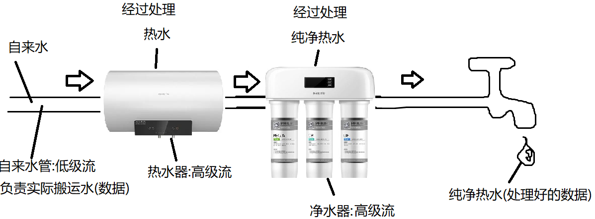
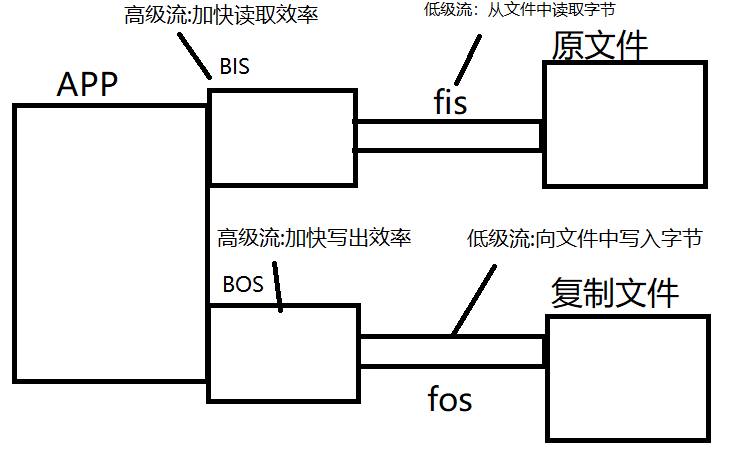
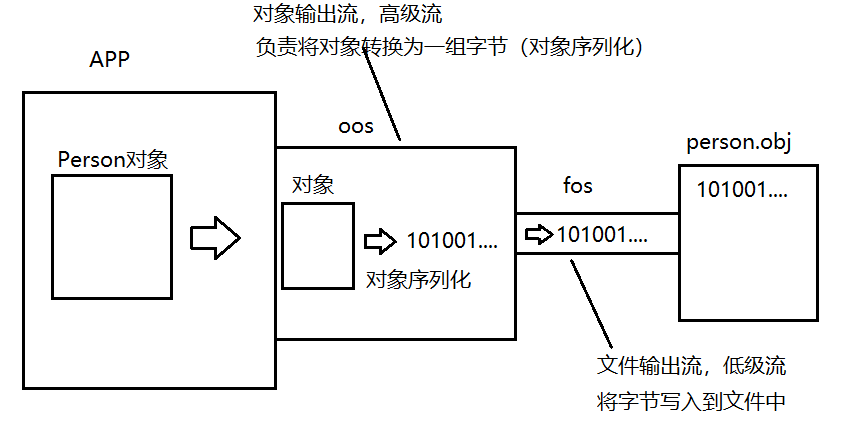

# day03

### 高级流

#### 流连接示意图



#### 缓冲流

##### java.io.BufferedOutputStream和BufferedInputStream.

缓冲流是一对高级流,作用是提高读写数据的效率.

缓冲流内部有一个字节数组,默认长度是8K.缓冲流读写数据时一定是将数据的读写方式转换为块读写来保证读写效率.

##### 使用缓冲流完成文件复制操作



```java
package io;

import java.io.*;

/**
 * java将流分为节点流与处理流两类
 * 节点流:也称为低级流，是真实连接程序与另一端的"管道",负责实际读写数据的流。
 *       读写一定是建立在节点流的基础上进行的。
 *       节点流好比家里的"自来水管"。连接我们的家庭与自来水厂，负责搬运水。
 * 处理流:也称为高级流，不能独立存在，必须连接在其他流上，目的是当数据经过当前流时
 *       对其进行某种加工处理，简化我们对数据的同等操作。
 *       高级流好比家里常见的对水做加工的设备，比如"净水器"，"热水器"。
 *       有了它们我们就不必再自己对水进行加工了。
 * 实际开发中我们经常会串联一组高级流最终连接到低级流上，在读写操作时以流水线式的加工
 * 完成复杂IO操作。这个过程也称为"流的连接"。
 *
 * 缓冲流，是一对高级流，作用是加快读写效率。
 * java.io.BufferedInputStream和java.io.BufferedOutputStream
 *
 */
public class CopyDemo3 {
    public static void main(String[] args) throws IOException {
        FileInputStream fis = new FileInputStream("ppt.pptx");
        BufferedInputStream bis = new BufferedInputStream(fis);
        FileOutputStream fos = new FileOutputStream("ppt_cp.pptx");
        BufferedOutputStream bos = new BufferedOutputStream(fos);
        int d;
        long start = System.currentTimeMillis();
        while((d = bis.read())!=-1){//使用缓冲流读取字节
            bos.write(d);//使用缓冲流写出字节
        }
        long end = System.currentTimeMillis();
        System.out.println("耗时:"+(end-start)+"ms");
        bis.close();//关闭流时只需要关闭高级流即可，它会自动关闭它连接的流
        bos.close();
    }
}
```

##### 缓冲输出流写出数据时的缓冲区问题

通过缓冲流写出的数据会被临时存入缓冲流内部的字节数组,直到数组存满数据才会真实写出一次

```java
package io;

import java.io.BufferedOutputStream;
import java.io.FileNotFoundException;
import java.io.FileOutputStream;
import java.io.IOException;
import java.nio.charset.StandardCharsets;

/**
 * 缓冲输出流写出数据的缓冲区问题
 */
public class BOS_FlushDemo {
    public static void main(String[] args) throws IOException {
        FileOutputStream fos = new FileOutputStream("bos.txt");
        BufferedOutputStream bos = new BufferedOutputStream(fos);

        String line = "奥里给!";
        byte[] data = line.getBytes(StandardCharsets.UTF_8);
        bos.write(data);
        System.out.println("写出完毕!");
        /*
            缓冲流的flush方法用于强制将缓冲区中已经缓存的数据一次性写出。
            注:该方法实际上实在字节输出流的超类OutputStream上定义的，并非只有缓冲
            输出流有这个方法。但是实际上只有缓冲输出流的该方法有实际意义，其他的流实现
            该方法的目的仅仅是为了在流连接过程中传递flush动作给缓冲输出流。
         */
        bos.flush();//冲

        bos.close();

    }
}
```

#### 对象流

java.io.ObjectOutputStream和ObjectInputSteam

对象流是一对高级流，在流连接中的作用是进行对象的序列化与反序列化。

对象序列化:将一个java对象按照其结构转换为一组字节的过程

对象反序列化:将一组字节还原为java对象(前提是这组字节是一个对象序列化得到的字节)

##### 对象序列化的流连接操作原理图:



```java
package io;

import java.io.FileNotFoundException;
import java.io.FileOutputStream;
import java.io.IOException;
import java.io.ObjectOutputStream;

/**
 * 对象流
 * java.io.ObjectInputStream和ObjectOutputStream
 *
 * 对象流的功能:进行对象序列化与反序列化
 * 对象序列化由对象输出流完成:将一个java对象按照其结构转换为一组字节的过程
 * 对象反序列化由对象输入流完成:将一组字节还原为一个java对象的过程
 *
 */
public class OOSDemo {
    public static void main(String[] args) throws IOException {
        //将一个Person对象写入文件person.obj中
        String name = "刘桑";
        int age = 55;
        String gender = "男";
        String[] otherInfo = {"技术好","拍片儿一流","大家的启蒙老师"};
        Person p = new Person(name,age,gender,otherInfo);

        //文件输出流(低级流):将字节写入指定文件中
        FileOutputStream fos = new FileOutputStream("person.obj");
        //对象输出流(高级流):将一个java对象进行序列化
        ObjectOutputStream oos = new ObjectOutputStream(fos);
        /*
            序列化时抛出异常:
            java.io.NotSerializableException
            说明序列化的类没有实现可序列化接口:java.io.Serializable

            这里将对象写出涉及到两个操作:
            对象经对象输出流时，会被文件输出流转换为一组字节,这个过程称为对象序列化
            序列化后的字节再经过文件流被写入文件中(硬盘中)，这个过程称为数据持久化
            所谓持久化就是可以长久保存了
         */
        oos.writeObject(p);
        System.out.println("写出完毕！");
        oos.close();

    }
}


```

##### 对象反序列化

```java
package io;

import java.io.FileInputStream;
import java.io.FileNotFoundException;
import java.io.IOException;
import java.io.ObjectInputStream;

/**
 * 使用对象输入流完成对象的反序列化
 */
public class OISDemo {
    public static void main(String[] args) throws IOException, ClassNotFoundException {
        //从person.obj文件中将对象反序列化回来
        FileInputStream fis = new FileInputStream("person.obj");
        ObjectInputStream ois = new ObjectInputStream(fis);
        /*
            Object readObject()
            该方法会进行对象的反序列化，如果对象流通过其连接的流读取的字节分析并非
            是一个java对象时，会抛出异常:ClassNotFoundException
         */
        Person p = (Person)ois.readObject();
        System.out.println(p);
    }
}
```

需要进行序列化的类必须实现接口:java.io.Serializable 实现序列化接口后最好主动定义序列化版本号这个常量。 这样一来对象序列化时就不会根据类的结构生成一个版本号,而是使用该固定值。 那么反序列化时，只要还原的对象和当前类的版本号一致就可以进行还原。

transient关键字可以修饰属性，用于在进行对象序列化时忽略不必要的属性，达到对象瘦身的目的

```java
package io;

import java.io.Serializable;
import java.util.Arrays;

/**
 * 使用当前类实例测试对象流的读写操作
 */
public class Person implements Serializable {
    public static final long serialVersionUID = 1L;
    private String name;//姓名
    private int age;//年龄
    private String gender;//性别
    private String[] otherInfo;//其他信息

    public Person(String name, int age, String gender, String[] otherInfo) {
        this.name = name;
        this.age = age;
        this.gender = gender;
        this.otherInfo = otherInfo;
    }

    public String getName() {
        return name;
    }

    public void setName(String name) {
        this.name = name;
    }

    public int getAge() {
        return age;
    }

    public void setAge(int age) {
        this.age = age;
    }

    public String getGender() {
        return gender;
    }

    public void setGender(String gender) {
        this.gender = gender;
    }

    public String[] getOtherInfo() {
        return otherInfo;
    }

    public void setOtherInfo(String[] otherInfo) {
        this.otherInfo = otherInfo;
    }

    @Override
    public String toString() {
        return "Person{" +
                "name='" + name + '\'' +
                ", age=" + age +
                ", gender='" + gender + '\'' +
                ", otherInfo=" + Arrays.toString(otherInfo) +
                '}';
    }
}
```


## 总结

##### java将流分为两类:节点流与处理流:

- **节点流**:也称为**低级流**.

  节点流的另一端是明确的,是实际读写数据的流,读写一定是建立在节点流基础上进行的.

- **处理流**:也称为**高级流**.

  处理流不能独立存在,必须连接在其他流上,目的是当数据流经当前流时对数据进行加工处理来简化我们对数据的该操作.

##### 实际应用中,我们可以通过串联一组高级流到某个低级流上以流水线式的加工处理对某设备的数据进行读写,这个过程也成为流的连接,这也是IO的精髓所在.

## 缓冲流

缓冲流是一对高级流，在流链接中链接它的**目的是加快读写效率**。缓冲流内部**默认缓冲区为8kb**，缓冲流**总是块读写数据来提高读写效率**。

#### java.io.BufferedOutputStream缓冲字节输出流，继承自java.io.OutputStream

##### 常用构造器

- BufferedOutputStream(OutputStream out)：创建一个默认8kb大小缓冲区的缓冲字节输出流，并连接到参数指定的字节输出流上。
- BufferedOutputStream(OutputStream out,int size)：创建一个size指定大小(单位是字节)缓冲区的缓冲字节输出流，并连接到参数指定的字节输出流上。

##### 常用方法

```
flush()：强制将缓冲区中已经缓存的数据一次性写出

缓冲流的写出方法功能与OutputStream上一致，需要知道的时write方法调用后并非实际写出，而是先将数据存入缓冲区(内部的字节数组中)，当缓冲区满了时会自动写出一次。
```

#### java.io.BufferedInputStream缓冲字节输出流，继承自java.io.InputStream

##### 常用构造器

- BufferedInputStream(InputStream in)：创建一个默认8kb大小缓冲区的缓冲字节输入流，并连接到参数指定的字节输入流上。
- BufferedInputStream(InputStream in,int size)：创建一个size指定大小(单位是字节)缓冲区的缓冲字节输入流，并连接到参数指定的字节输入流上。

##### 常用方法

```
缓冲流的读取方法功能与InputStream上一致，需要知道的时read方法调用后缓冲流会一次性读取缓冲区大小的字节数据并存入缓冲区，然后再根据我们调用read方法读取的字节数进行返回，直到缓冲区所有数据都已经通过read方法返回后会再次读取一组数据进缓冲区。即:块读取操作
```

### 对象流

对象流是一对高级流，在流链接中的作用是完成对象的**序列化**与**反序列化**

序列化：是对象输出流的工作，将一个对象按照其结构转换为一组字节的过程。

反序列化：是对象输入流的工作，将一组字节还原为对象的过程。

#### java.io.ObjectInputStream对象输入流，继承自java.io.InputStream

##### 常用构造器

ObjectInputStream(InputStream in)：创建一个对象输入流并连接到参数in这个输入流上。

##### 常用方法

Object readObject()：进行对象反序列化，将读取的字节转换为一个对象并以Object形式返回(多态)。

如果读取的字节表示的不是一个java对象会抛出异常:java.io.ClassNotFoundException

#### java.io.ObjectOutputStream对象输出流，继承自java.io.OutputStream

##### 常用构造器

ObjectOutputStream(OutputStream out)：创建一个对象输出流并连接到参数out这个输出流上

##### 常用方法

void writeObject(Object obj)：进行对象的序列化，将一个java对象序列化成一组字节后再通过连接的输出流将这组字节写出。

**如果序列化的对象没有实现可序列化接口:java.io.Serializable就会抛出异常:java.io.NotSerializableException**

#### 序列化接口java.io.Serrializable

该接口没有任何抽象方法，但是只有实现了该接口的类的实例才能进行序列化与反序列化。

实现了序列化接口的类建议显示的定义常量:static final long serialVersionUID = 1L;

可以为属性添加关键字**transient**，被该关键字修饰的属性在序列化是会被忽略，达到对象**序列化瘦身**的目的。

