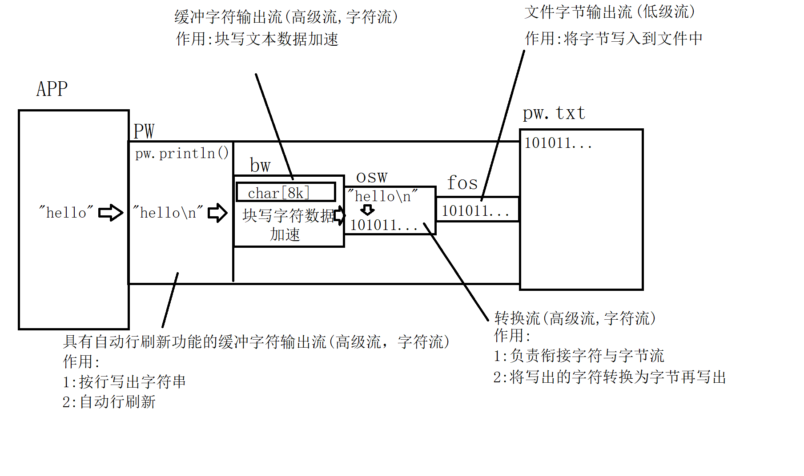
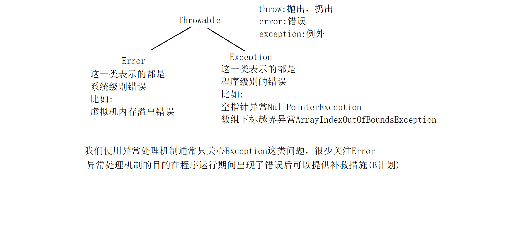

# day04

#### 缓冲字符流

##### 缓冲字符输出流:java.io.PrintWriter

java.io.BufferedWriter和BufferedReader

缓冲字符流内部也有一个缓冲区,读写文本数据以块读写形式加快效率.并且缓冲流有一个特别的功能:可以按行读写文本数据.

java.io.PrintWriter具有自动行刷新的缓冲字符输出流,实际开发中更常用.它内部总是会自动连接BufferedWriter作为块写加速使用.



```java
package io;

import java.io.FileNotFoundException;
import java.io.FileOutputStream;
import java.io.PrintWriter;
import java.io.UnsupportedEncodingException;

/**
 * 缓冲字符流(是一对高级流)
 * java.io.BufferedWriter和BufferedReader
 * 缓冲流内部维护一个char数组，默认长度8k.以块读写方式读写字符数据保证效率
 *
 * java.io.PrintWriter则是具有自动行刷新的换成字符输出流(实际缓冲功能是靠BufferedWriter
 * 实现的，它内部总是连接着这个流。)
 *
 * 使用缓冲字符流后就可以实现按行读写字符串，并且读写效率高。
 */
public class PWDemo1 {
    public static void main(String[] args) throws FileNotFoundException, UnsupportedEncodingException {
        //按行向文件pw.txt中写入字符串
        /*
            PrintWriter继承自Writer.
            它提供很多构造方法，其中就有可以直接对文件进行写操作的构造器
            PrintWriter(File file)
            PrintWriter(String filename)
         */
//        PrintWriter pw = new PrintWriter("pw.txt");
        /*
            这里可以按照指定的字符集写出字符串到文本文件中。但是字符集只能以字符串形式
            表达。因此注意拼写。字符集不区分大小写。
            但是如果字符集名字拼写错误，会抛出异常:
            UnsupportedEncodingException
            不支持的    字符集    异常
         */
        PrintWriter pw = new PrintWriter("pw.txt","UTF-8");
        /*
            println()方法是输出字符出后带上换行符
            print()方法输出字符串后不带换行符
         */
        pw.println("夜空中最亮的星，能否听清。");
        pw.println("那仰望的人，心底的孤独和叹息。");
        System.out.println("写出完毕!");
        pw.close();

    }
}

```

##### 在流链接中使用PW

```java
package io;

import java.io.*;
import java.nio.charset.StandardCharsets;
import java.util.Scanner;

/**
 * 练习PrintWriter的流连接操作
 */
public class PWDemo2 {
    public static void main(String[] args) throws FileNotFoundException {
        //文件输出流(低级流，字节流) 作用:向文件中写出字节
        FileOutputStream fos = new FileOutputStream("pw2.txt");
        //转换输出流(高级流，字符流) 作用:1衔接字符与字节流的 2:将写出的字符转换为字节
        OutputStreamWriter osw = new OutputStreamWriter(fos, StandardCharsets.UTF_8);
        //缓冲字符输出流(高级流，字符流) 作用:块写文本数据加速的(内部有一个8k的char数组)
        BufferedWriter bw = new BufferedWriter(osw);
        //具有自动行刷新功能(高级流，字符流) 作用:1按行写出字符串(println) 2:自动行刷新
        PrintWriter pw = new PrintWriter(bw);

        /*
            完成一个简易记事本工具
            将控制台上输入的每一行字符串按行写入到该文件中
            如果单独输入exit,则程序退出。
            思路:
            用一个死循环，重复做下面的工作
            1:在控制台上输入一行字符串
            2:判断输入的字符串是否为"exit"
              若是:则break掉循环退出程序
              若不是:则将输入的字符串通过println方法写入文件
         */
        Scanner scanner = new Scanner(System.in);
        while(true) {
           String line = scanner.nextLine();
           if("exit".equals(line)){
                break;
           }
           pw.println(line);
        }
        System.out.println("写出完毕!");

        pw.close();
    }
}

```


##### PrintWriter的自动行刷新功能

如果实例化PW时第一个参数传入的是一个流，则此时可以再传入一个boolean型的参数，此值为true时就打开了自动行刷新功能。 即: 每当我们用PW的println方法写出一行字符串后会自动flush.

```java
package io;

import java.io.*;
import java.nio.charset.StandardCharsets;
import java.util.Scanner;

/**
 * 练习PrintWriter的流连接操作
 */
public class PWDemo2 {
    public static void main(String[] args) throws FileNotFoundException {
        //文件输出流(低级流，字节流) 作用:向文件中写出字节
        FileOutputStream fos = new FileOutputStream("pw2.txt");
        //转换输出流(高级流，字符流) 作用:1衔接字符与字节流的 2:将写出的字符转换为字节
        OutputStreamWriter osw = new OutputStreamWriter(fos, StandardCharsets.UTF_8);
        //缓冲字符输出流(高级流，字符流) 作用:块写文本数据加速的(内部有一个8k的char数组)
        BufferedWriter bw = new BufferedWriter(osw);
        //具有自动行刷新功能(高级流，字符流) 作用:1按行写出字符串(println) 2:自动行刷新
        /*
            当我们创建PrintWriter时，构造方法里第一个参数为一个流，那么就支持再传入
            一个boolean值参数表示是否打开自动行刷新功能，传入true则打开。
            此时每当我们调用它的println方法写出一行字符串后就会自动flush()一次。
            注意:print方法和write方法写出字符串时并不会自动flush()!!!!
         */
        PrintWriter pw = new PrintWriter(bw,true);

        /*
            完成一个简易记事本工具
            将控制台上输入的每一行字符串按行写入到该文件中
            如果单独输入exit,则程序退出。
            思路:
            用一个死循环，重复做下面的工作
            1:在控制台上输入一行字符串
            2:判断输入的字符串是否为"exit"
              若是:则break掉循环退出程序
              若不是:则将输入的字符串通过println方法写入文件
         */
        Scanner scanner = new Scanner(System.in);
        while(true) {
           String line = scanner.nextLine();
           if("exit".equals(line)){
                break;
           }
           pw.println(line);
//           pw.print("");//不会自动flush
//           pw.write("");//不会自动flush
        }
        System.out.println("写出完毕!");

        pw.close();
    }
}

```

#### 缓冲字符流

##### 缓冲字符输入流:java.io.BufferedReader

是一个高级的字符流，特点是块读文本数据，并且可以按行读取字符串。

```java
package io;

import java.io.*;

/**
 * 使用缓冲字符输入流按行读取字符串
 * 该高级流的主要作用:
 * 1:块读文本数据加速(内部有一个默认8k的char数组)
 * 2:可以按行读取字符串
 */
public class BRDemo {
    public static void main(String[] args) throws IOException {
        //将当前源代码输出到控制台上
        /*
            思路:
            读取当前源代码文件，按行读取，并且将读取到的每一行字符串都输出到控制台上即可
         */
        //文件输入流(低级流，字节流) 作用:从文件中读取字节
        FileInputStream fis = new FileInputStream("./src/io/BRDemo.java");
        //转换输入流(字符流，高级流) 作用:1衔接字节与字符流 2将读取的字节转换为字符
        InputStreamReader isr = new InputStreamReader(fis);
        //缓冲字符输入流(字符流，高级流) 作用:1块读字符数据加速  2按行读取字符串
        BufferedReader br = new BufferedReader(isr);
        /*
            BufferedReader缓冲字符输入流
            提供了一个独有的方法:readLine()
            作用:读取一行字符串。连续读取若干字符直到遇到了换行符位置，并将换行符之前的
                内容返回。注意:返回的字符串里不包含最后的换行符。
                特殊情况:
                如果这一行只有一个换行符，那么返回值为空字符串:""
                如果读取到了流的末尾，那么返回值为null。

            实际运行时:
            当我们第一次调用readLine()方法时，缓冲字符输入流实际会一次性读取8k的char
            回来并存入内部的char数组中(块读文本操作)。readLine方法只将char数组中从头
            开始一直到第一个换行符位置的内容以一个字符串形式返回。
         */
        String line;
        while((line = br.readLine()) != null){
            System.out.println(line);
        }

        br.close();
    }
}


```

##### IO总结


### 异常处理

#### java异常处理机制

- java中所有错误的超类为:Throwable。其下有两个子类:Error和Exception

- Error的子类描述的都是系统错误，比如虚拟机内存溢出等。

- Exception的子类描述的都是程序错误，比如空指针，下表越界等。

- 通常我们程序中处理的异常都是Exception。

  


```java
package exception;

/**
 * 异常处理机制中的try-catch
 * 语法:
 * try{
 *     代码片段...
 * }catch(XXXException e){
 *     出现错误后的补救措施(B计划)
 * }
 */
public class TryCatchDemo {
    public static void main(String[] args) {
        System.out.println("程序开始了...");
        /*
            try{}语句块不能单独写，后面要么跟catch语句块要么跟finally语句块

            异常处理机制关注的是:明知道程序可能出现某种错误，但是该错误无法通过修改逻辑
            完全规避掉时，我们会使用异常处理机制，在出现该错误是提供一种补救办法。
            凡是能通过逻辑避免的错误都属于bug！就应当通过逻辑去避免!
         */
        try {
//            String str = null;
//            String str = "";
            String str = "a";
        /*
            若str=null的情况
            当JVM执行到下面代码时:str.length()会出现空指针，此时虚拟机就会根据该情况
            实例化一个对应的异常实例出来，即:空指针异常实例 NullPointerException实例
            然后将程序从一开始执行到报错这句话的过程设置到该异常实例中，此时该异常通过
            类型名字可以表达出现了什么错误，并将来可以通过输出错误信息来得知错误出现在那里
            虚拟机会将该异常抛出
            当某句代码抛出了一个异常时，JVM会做如下操作:
            1:检查报错这句话是否有被异常处理机制控制(有没有try-catch)
              如果有，则执行对应的catch操作，如果没有catch可以捕获该异常则视为没有
              异常处理动作
            2:如果没有异常处理，则异常会被抛出当当前代码所在的方法之外由调用当前方法的
              代码片段处理该异常
         */
            System.out.println(str.length());//抛出空指针异常
            System.out.println(str.charAt(0));
            System.out.println(Integer.parseInt(str));
            /*
                当try中某句代码报错后，就会跳出try执行下面对应的catch块，执行后就会
                退出catch继续向后执行。因此try语句块中报错代码以下的内容都不会被执行
             */
            System.out.println("!!!!!!!!!!!!!!");
//        }catch(NullPointerException e){
//            //这里实际开发中是写补救措施的，通常也会将异常信息输出便于debug
//            System.out.println("出现了空指针，并解决了!");
//        }catch(StringIndexOutOfBoundsException e){
//            System.out.println("处理字符串下标越界问题!");
//        }
        /*
            当try语句块中可能出现的几种不同异常对应的处理办法相同时，可以采取合并
            catch的做法，用同一个catch来捕获这几种可能出现的异常，而执行措施使用
            同一个。
         */
        }catch(NullPointerException|StringIndexOutOfBoundsException e){
            System.out.println("处理空指针或下标越界!");
        /*
            当catch捕获某个超类型异常时，那么try语句块中出现它类型异常时都可以被这个
            catch块捕获并处理。

            如果多个catch捕获的异常之间存在继承关系时，一定是子类异常在上超类异常在下
         */
        }catch(Exception e){
            System.out.println("反正就是出了个错!");
        }
        System.out.println("程序结束了...");
    }
}

```

#### 


## 总结

### 缓冲字符输出流

缓冲字符输出流需要记住的是PrintWriter和BufferedReader

作用:

1:块写或块读文本数据加速

2:可以按行写或读字符串

#### java.io.PrintWriter 具有自动行刷新的缓冲字符输出流

##### 常用构造器

PrintWriter(String filename) :可以直接对给定路径的文件进行写操作

PrintWriter(File file):可以直接对File表示的文件进行写操作

上述两种构造器内部会自动完成流连接操作。

PrintWriter(OutputStream out):将PW链接在给定的字节流上(构造方法内部会自行完成转换流等流连接)

PrintWriter(Writer writer):将PW链接在其它字符流上

PrintWriter(OutputStream out,boolean autoflush)

PrintWriter(Writer writer,boolean autoflush)

上述两个构造器可以在链接到流上的同时传入第二个参数，如果该值为true则开启了自动行刷新功能。

##### 常用方法

void println(String line)：按行写出一行字符串

##### 特点

自动行刷新，当打开了该功能后，每当使用println方法写出一行字符串后就会自动flush一次

#### java异常处理机制:

- 异常处理机制是用来处理那些可能存在的异常，但是无法通过修改逻辑完全规避的场景。
- 而如果通过修改逻辑可以规避的异常是bug，不应当用异常处理机制在运行期间解决！应当在编码时及时修正

try语句块用来包含可能出错的代码片段

catch用来捕获并处理对应的异常，可以定义多个，也可以合并多个异常在一个catch中。
